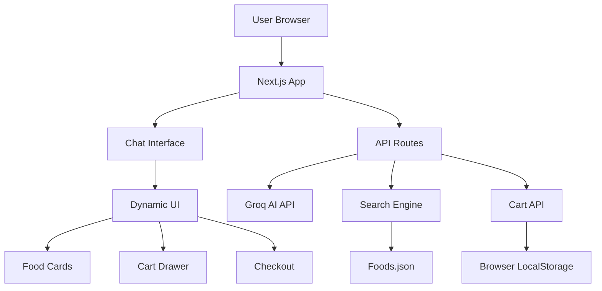
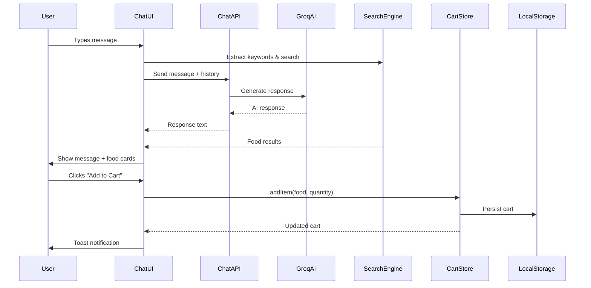

# 🏗️ Architecture Documentation

## System Architecture



## Technology Stack

### Frontend
- **Next.js 14** (App Router)
  - Server and client components
  - API routes for backend
  - Built-in image optimization
  - TypeScript support

- **React 18**
  - Hooks for state management
  - Component composition
  - Client-side interactivity

- **Tailwind CSS**
  - Utility-first styling
  - Responsive design
  - Custom color system
  - Dark mode ready

- **Framer Motion**
  - Smooth animations
  - Page transitions
  - Component animations

### Backend
- **Next.js API Routes**
  - Serverless functions
  - RESTful endpoints
  - JSON responses

- **Groq SDK**
  - AI chat completions
  - Llama 3.1 70B model
  - Fast inference

### State Management
- **Zustand**
  - Cart state
  - Persistent storage
  - Simple API

- **React Hooks**
  - Component state
  - Side effects
  - Context

### Data Layer
- **In-Memory Search**
  - Fast keyword matching
  - Filter application
  - Result ranking

- **JSON Data Store**
  - 100+ food items
  - Rich metadata
  - Images

## Component Architecture

### Page Structure

```
app/
├── layout.tsx          → Root layout, global providers
├── page.tsx            → Main chat interface
└── api/
    ├── chat/route.ts   → AI chat endpoint
    └── order/route.ts  → Order placement
```

### Component Hierarchy

```
App
├── Header
│   ├── Logo
│   └── CartButton → Opens CartDrawer
├── ChatInterface
│   ├── WelcomeScreen (empty state)
│   ├── MessageList
│   │   ├── ChatMessage (user/assistant)
│   │   └── FoodGrid (dynamic UI)
│   │       └── FoodCard[]
│   └── MessageInput
└── CartDrawer
    ├── CartSummary
    │   └── CartItem[]
    └── CheckoutForm
```

### State Flow



## Data Flow

### 1. Food Data Loading

```typescript
// At build time
Foods.json → getAllFoods() → FoodWithEmbedding[]
                           ↓
                    In-memory cache
```

### 2. Search Flow

```typescript
User Query → Keyword Extraction → Filter Application
                                         ↓
                                  Search Algorithm
                                         ↓
                                  Score & Rank
                                         ↓
                                  Top N Results
```

### 3. Chat Flow

```typescript
User Message → ChatInterface → API /chat
                                    ↓
                              Groq AI (Llama 3.1)
                                    ↓
                              AI Response
                                    ↓
                              ChatInterface
                                    ↓
                              Display + Food Cards
```

### 4. Cart Flow

```typescript
Add to Cart → CartStore.addItem()
                    ↓
              Update state
                    ↓
              Persist to localStorage
                    ↓
              Trigger re-render
                    ↓
              Update UI (badge, drawer)
```

## API Endpoints

### POST /api/chat

**Purpose**: Handle chat messages and generate AI responses

**Request:**
```json
{
  "messages": [
    { "role": "user", "content": "Show me vegetarian options" }
  ]
}
```

**Response:**
```json
{
  "message": "Here are our vegetarian dishes!",
  "role": "assistant"
}
```

**Implementation:**
- Receives conversation history
- Calls Groq API with system prompt
- Returns AI-generated response
- Handles errors gracefully

### POST /api/order

**Purpose**: Place an order

**Request:**
```json
{
  "name": "John Doe",
  "phone": "+91 98765 43210",
  "address": "123 Main St, Mumbai",
  "notes": "Extra spicy",
  "items": [...],
  "total": 1247
}
```

**Response:**
```json
{
  "success": true,
  "order": {
    "id": "ORD-1234567890",
    "status": "confirmed",
    "estimatedDelivery": "30-45 minutes"
  }
}
```

**Implementation:**
- Validates order data
- Generates unique order ID
- Stores in memory (or DB in production)
- Returns confirmation

## Search Algorithm

### Scoring System

```typescript
function calculateScore(food: Food, query: string): number {
  let score = 0;
  
  // Exact name match (highest priority)
  if (food.name.toLowerCase().includes(query)) {
    score += 10;
  }
  
  // Description match
  if (food.description.toLowerCase().includes(query)) {
    score += 5;
  }
  
  // Ingredient match
  if (food.ingredients.some(ing => ing.toLowerCase().includes(query))) {
    score += 4;
  }
  
  // Category match
  if (food.category.toLowerCase().includes(query)) {
    score += 3;
  }
  
  // Keyword frequency
  query.split(' ').forEach(word => {
    if (word.length > 2 && food.searchText.includes(word)) {
      score += 1;
    }
  });
  
  return score;
}
```

### Filter Application

```typescript
function applyFilters(foods: Food[], filters: SearchFilters): Food[] {
  return foods.filter(food => {
    // Type filter (Vegetarian/Non-Vegetarian)
    if (filters.type && food.type !== filters.type) return false;
    
    // Spice level filter
    if (filters.spiceLevel && food.spiceLevel !== filters.spiceLevel) return false;
    
    // Nutrition filters
    if (filters.maxCalories && food.nutrition.calories > filters.maxCalories) return false;
    if (filters.minProtein && parseInt(food.nutrition.protein) < filters.minProtein) return false;
    if (filters.maxCarbs && parseInt(food.nutrition.carbs) > filters.maxCarbs) return false;
    
    // Price filter
    if (filters.maxPrice && food.price > filters.maxPrice) return false;
    
    return true;
  });
}
```

## AI Integration

### System Prompt Strategy

**Goals:**
1. Set personality (friendly, helpful waiter)
2. Define capabilities (search, recommend, guide)
3. Establish rules (concise, contextual, proactive)
4. Provide examples (few-shot learning)

**Key Elements:**
- Role definition
- Tone guidelines
- Conversation patterns
- Example interactions
- Constraints and rules

### Conversation Context

**What We Track:**
- Last 10 messages
- User preferences mentioned
- Cart state
- Previous search queries

**Why Limited History:**
- API token limits
- Relevance decay
- Performance
- Cost optimization

### Response Generation

```typescript
// System prompt + conversation history → Groq API
const completion = await groq.chat.completions.create({
  messages: [
    { role: 'system', content: SYSTEM_PROMPT },
    ...conversationHistory,
    { role: 'user', content: userMessage },
  ],
  model: 'llama-3.1-70b-versatile',
  temperature: 0.7,
  max_tokens: 1024,
});
```

**Parameters:**
- `temperature: 0.7` → Balanced creativity/consistency
- `max_tokens: 1024` → Concise responses
- `model: llama-3.1-70b-versatile` → Good reasoning, fast

## Performance Optimizations

### 1. Image Optimization
- Next.js Image component
- Lazy loading
- Responsive sizes
- WebP format
- Blur placeholder

### 2. Search Performance
- In-memory data (no DB queries)
- Pre-computed search text
- Efficient scoring algorithm
- Result caching

### 3. State Management
- Zustand (minimal re-renders)
- Selective subscriptions
- Optimistic updates

### 4. Code Splitting
- Automatic with Next.js
- Dynamic imports for heavy components
- Route-based splitting

### 5. Caching
- Static assets cached
- API responses cached (where appropriate)
- Browser localStorage for cart

## Security Considerations

### API Key Protection
- Environment variables only
- Never exposed to client
- Vercel secrets in production

### Input Validation
- Sanitize user input
- Validate order data
- Type checking with TypeScript

### XSS Prevention
- React automatic escaping
- No dangerouslySetInnerHTML
- Sanitized user content

## Scalability Considerations

### Current Limitations (MVP)
- In-memory data (single server)
- No database
- No user authentication
- No real-time features

### Scaling Path

**100-1000 orders/day:**
- Current architecture sufficient
- Add Redis for cart
- Add PostgreSQL for orders

**1000-10000 orders/day:**
- Add database (PostgreSQL)
- Add caching layer (Redis)
- Add CDN for images
- Add user authentication

**10000+ orders/day:**
- Microservices architecture
- Separate AI service
- Database replication
- Load balancing
- Message queue for orders

## Error Handling

### Frontend Errors
- Try-catch blocks
- Error boundaries
- Fallback UI
- Toast notifications
- Retry mechanisms

### Backend Errors
- API error responses
- Logging
- Graceful degradation
- Timeout handling

### AI Errors
- Fallback responses
- Retry logic
- Rate limit handling
- Error messages to user

## Testing Strategy

### Manual Testing
- User flow testing
- Cross-browser testing
- Mobile device testing
- Edge case testing

### Automated Testing (Future)
- Unit tests (Jest)
- Integration tests (Playwright)
- E2E tests (Cypress)
- Performance tests

## Deployment Architecture

### Vercel Deployment

```
GitHub Repo → Vercel Build → Edge Network
                    ↓
              Environment Variables
                    ↓
              Serverless Functions
                    ↓
              Global CDN
```

**Benefits:**
- Zero-config deployment
- Automatic HTTPS
- Global CDN
- Serverless scaling
- Preview deployments

### Docker Deployment

```
Dockerfile → Build Image → Run Container
                              ↓
                        Expose Port 3000
                              ↓
                        Serve Application
```

**Benefits:**
- Consistent environment
- Easy local testing
- Portable
- Cloud-agnostic

## Monitoring & Observability

### Current (MVP)
- Console logging
- Error tracking in browser
- Vercel analytics (basic)

### Future
- Sentry for error tracking
- PostHog for analytics
- LogRocket for session replay
- Custom dashboards

## Conclusion

This architecture prioritizes:
1. **Simplicity**: Easy to understand and maintain
2. **Performance**: Fast responses and smooth UX
3. **Scalability**: Clear path to scale
4. **Developer Experience**: Modern tools and patterns

The system is production-ready for MVP scale and has a clear path for growth.

---

**Architecture designed for speed, simplicity, and scalability** 🏗️
